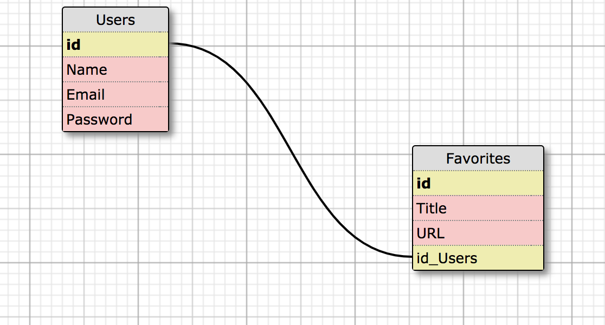

# Hubble Helper

Hubble Helper is an app for viewing and favoriting images from the Hubble API.

This project was submitted as the final project of Module 4 of the back-end program at Turing School of Software and Design. The goal of the project was to mimic a take-home challenge that a person may receive during a job application process.

Check out the deployed site here: https://hubble-helper.herokuapp.com/photos

## Table of Contents

* Schema
* Prerequisites
* Testing Dependencies
* APIs consumed (keys required)
* Additional Gems
* Installation
* Running the Test Suite
* Known Issues
* How To Contribute
* Core Contributors

## Schema

## Prerequisites

* Ruby v. 2.4
* Rails v. 5.2
* Puma v. 3.7
* PG v. 1.1.3

## APIs Consumed  / External Services
[NASA Image API](https://api.nasa.gov/api.html#Images)
## Testing Dependencies

* Rspec-Rails
* Capybara
* Factory_bot_rails
* Webmock
* VCR
* Faraday

## Additional Gems

* Bcrypt
* Shoulda-matchers
* Database_cleaner
* Figaro
* Bootstrap

## Installation
Clone down this repository, change into the root directory and run:
` git clone git@github.com:tmaria17/hubble_helper.git`

Run
`bundle`

To setup the database necessary for this app, run the following commands:

`bundle exec rake db:create`

`bundle exec rake db:migrate`

`bundle exec rake db:seed`

## Running the Test Suite

Run `bundle exec rspec` to run the full test suite.

Run `bundle exec rspec <TEST FILE PATH>` to run a specific test

## Known Issues/ To Do
* Add OAuth (this app is currently only setup for one user)
* Redirect from creative favorite to photos is jumpy
* Additional Styling

## How to Contribute
To contribute to this project please fork this repo and submit a pull request.

## Core Contributors
* [Maria Torres](https://github.com/tmaria17)
